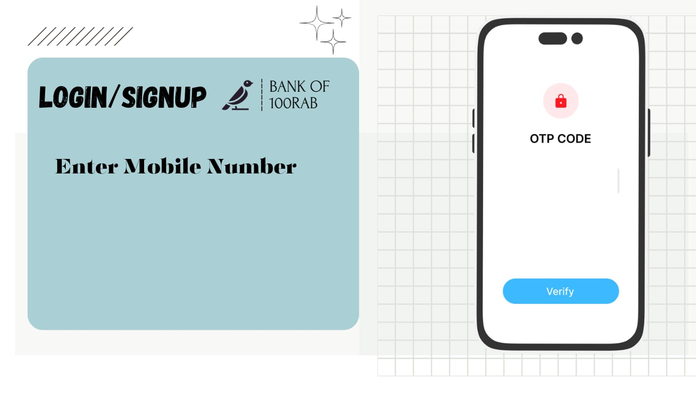

# BankProject_.NET

A small banking system created using C# and .NET. This application provides basic functionalities such as creating accounts, logging in, and viewing account balances. Deposit and withdrawal functionalities are upcoming features.

## Table of Contents

- [Overview](#overview)
- [Features](#features)
- [Screenshots](#screenshots)
- [Installation](#installation)
- [Usage](#usage)
- [Contributing](#contributing)
- [License](#license)

## Overview

This project is a simple banking system application developed in C# with the .NET framework. It allows users to perform essential banking operations such as account creation, login, and balance inquiry. Upcoming features include deposit and withdrawal functionalities.

## Features

- User registration
- User login
- View account balances
- Simple and intuitive user interface

## Upcoming Features

- Deposit money into accounts
- Withdraw money from accounts

## Screenshots

### Registration Screen


### Login Screen


## Installation

1. Clone the repository:
    ```sh
    git clone https://github.com/yourusername/BankProject_.NET.git
    ```

2. Navigate to the project directory:
    ```sh
    cd BankProject_.NET
    ```

3. Open the solution file (`Bank_project.sln`) in Visual Studio.

4. Build the project to restore dependencies and compile the application.

## Usage

1. Run the application from Visual Studio.
2. Use the GUI to interact with the banking system.
    - Register a new account
    - Log in to your account
    - Check account balances

## Contributing

Contributions are welcome! Please fork the repository and create a pull request with your changes.

1. Fork the repository
2. Create your feature branch (`git checkout -b feature/YourFeature`)
3. Commit your changes (`git commit -m 'Add some feature'`)
4. Push to the branch (`git push origin feature/YourFeature`)
5. Open a pull request

## License

This project is licensed under the MIT License. See the [LICENSE](LICENSE) file for details.
